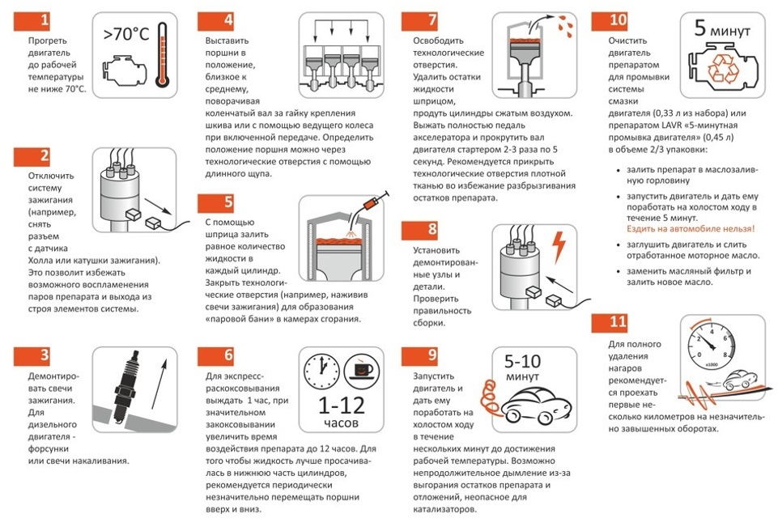

# Точка зрения

  Наш проект входит в направление «Взгляд». Основная задача заключается в отображении необходимой информации, возможности удобно и быстро осуществлять необходимые действия. Мы наблюдали за тем, как люди обращаются со своими деньгами на электронных счетах, в том числе, как совершают переводы между платежными системами.
  
  Выбранная точка зрения: «Деньги, находящиеся на счетах, должны быть удобны в обращении, как при переводах и платежах, так и при их конвертации в наличные».

# Доска вдохновения

•	Инструкция
•	Карта
•	Перевод
•	Кошелек
•	Удобство
•	Скорость
•	Деньги
•	Банк
•	Информация 
•	Экономия

# Вдохновения:
1)	Карта: схематичное изображение местности, на котором легко найти объект нужной категории. С помощью карты можно легко и удобно найти необходимые объекты, для нашего приложения данными объектами служат банкоматы и отделения банков.

2)	Перевод: сама идея перевода средств с одного кошелька на другой нам показалась очень важной в настоящее время, так как людям иногда необходимо совершать транзакции. У нашего приложения будет возможность сделать переводы средств более быстрыми, удобными и эффективными в плане экономии средств.

3)	Экономия: бережливость, расчетливость в расходовании чего-нибудь. Некоторые люди не умеют экономно обращаться с деньгами, и не все знают про возможности экономии во время перевода средств. Наше приложение позволит более эффективно и экономно совершать переводы. 

4)	Скорость: затраченное время и выполненные действия для достижения какой-либо цели. Наше приложение поможет ускорить выполнение некоторых действий.

5)	Инструкция: понятная, упорядоченная последовательность действий для достижения желаемого результата. Наше приложение будет предлагать справочную информацию, облегчающую использование инфраструктуры, предлагаемой банками.

# Раскадровки

1)	Володя задолжал дяде Богдану. Дядя Богдан требует вернуть Володю деньги, причем наличными, но у Володи с собой только карта его банка. Поэтому Володя достает свой смартфон, запускает наше приложение и находит ближайший банкомат, в котором можно снять деньги, после чего возвращает долг дяде Богдану.

2)	Петя задолжал Олегу. Олег не против получить деньги на карту, но есть проблема: у Пети и Олега карты разных банков, и перевод можно сделать только с большой комиссией. Поэтому Петя запускает наше приложение и выясняет, что комиссию при переводе можно снизить, если сначала перевести деньги на кошелек третьей платежной системы. Петя совершает перевод, сведя затраты к минимуму.

